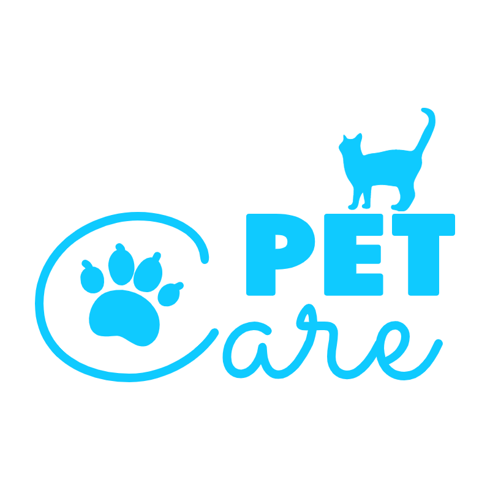

# youtube-clone

# 결과물 비교 왼쪽 원본 || 오른쪽 클론

+ 본래 참고 했던 Youtube 페이지


#### > 1회차 - 약 2시간 소요
1. 레이아웃 제작
2. 고정요소 고정

#### > 2회차 - 약 4시간 소요
1. header, nav 제작

#### > 3회차 - 약 4시간 소요
1. 원본과 비슷하게 레이아웃 조정
2. section - ad 부분 제작
3. header - search 부분 제작

#### > 4회차 - 약 3시간 소요
1. section - ad 부분에 아이콘 추가
2. section - video 부분 제작
> UI 제작 완료 - 약 13시간 소요

#### > 결과 영상

## CODE - 드러움 주의

#### index.html
비디오 부분은 같은 것을 복붙한 것이기에 하나만 넣어두었다.
```
<!DOCTYPE html>
<html lang="en">
<head>
    <meta charset="UTF-8">
    <meta http-equiv="X-UA-Compatible" content="IE=edge">
    <meta name="viewport" content="width=device-width, initial-scale=1.0">
    <title>Youtube Clone</title>
    <link rel="shortcut icon" href="./img/favicon.ico" type="image/x-icon">
    <link rel="stylesheet" href="style.css">

    <link href="https://fonts.googleapis.com/icon?family=Material+Icons" rel="stylesheet">
</head>
<body>
    <header>          
        <div class="logo-container">
            <div class="menu-btn">
                <i class="material-icons">menu</i>
            </div>      
            <a href="" class="logo">              
                
                <div class="lang-kr">KR</div>
            </a>
        </div>
        <div class="search-container">
            <div class="search">
                <input type="text" class="search-box" placeholder="검색"/>
                <i class="material-icons keyboard">keyboard</i>  
            </div>
                <button  type="button" class="search-btn"><i class="material-icons keyboard">search</i></button>                                                   
            <div class="mike">
                <i class="material-icons keyboard">mic</i>  
            </div>                                                
            </div>                                           
        </div>          
        <div class="setting-container">
            <i class="material-icons">video_call</i>
            <i class="material-icons">apps</i>
            <i class="material-icons">notifications_none</i>
                     
        </div>
    </header>
    <div class="line-up">
        <nav>
            <div class="menu-container">
                <div class="menu-box">
                    <i class="material-icons">home</i><p>홈</p>
                    <i class="material-icons">explore</i><p>탐색</p>
                    <i class="material-icons">subscriptions</i><p>구독</p>
                    <i class="material-icons">video_library</i><p>보관함</p>  
                    <i class="material-icons">history</i><p>시청 기록</p>
                </div>   
            </div>
        </nav>
        <section>
            <div class="ads-section">
                <div class="main-ad-video">
                    <video autoplay controls>
                        <source src="./video/ads.mp4" type="video/mp4">
                        광고 영상입니다.
                    </video>
                </div>
                <div class="channel">
                    <div class="channel-info">
                        <div class="channel-icon">
                            
                        </div>
                        <div class="ad-info">
                            <p>엄마 고양이와 아기 고양이 <i class="material-icons">more_vert</i></p>
                            <span>광고</span><a href="">고양이친구들</a><br>
                            <button type="button">영상 더보기</button>
                        </div>
                    </div>
                    <div class="more-video">
                        <video >
                            <source src="./video/ads_sample1.mp4" type="video/mp4">
                            광고 영상입니다.
                        </video>
                        <video >
                            <source src="./video/ads_sample2.mp4" type="video/mp4">
                            광고 영상입니다.
                        </video>
                    </div>
                </div>
            </div>
            <div class="grid-section">
                <div class="video-container">
                    <div class="video">
                        <video>
                            <source src="./video/video_sample3.mp4" type="video/mp4">
                            영상
                        </video>
                    </div>
                    <div class="video-channel-info">
                        <div class="video-channel-logo">
                            
                        </div>
                        <div class="video-info">
                            <p class="video-title">아기 고양이</p>
                            <p class="video-channel-title">고양이친구들</p>
                            <p class="video-view-count">조회수 140만회・10일 전</p>
                        </div>
                    </div>                   
                </div>       
              </div>
        </section>
    </div>      
</body>
</html>
```

#### style.css
```
/*초기화*/
html, body, div, span, applet, object, iframe,
h1, h2, h3, h4, h5, h6, p, blockquote, pre,
a, abbr, acronym, address, big, cite, code,
del, dfn, em, img, ins, kbd, q, s, samp,
small, strike, strong, sub, sup, tt, var,
b, u, i, center,
dl, dt, dd, ol, ul, li,
fieldset, form, label, legend,
table, caption, tbody, tfoot, thead, tr, th, td,
article, aside, canvas, details, embed,
figure, figcaption, footer, header, hgroup,
menu, nav, output, ruby, section, summary,
time, mark, audio, video {
  margin: 0;
  padding: 0;
  border: 0;
  font-size: 100%;
  font: inherit;
  vertical-align: baseline;
}

article, aside, details, figcaption, figure,
footer, header, hgroup, menu, nav, section {
  display: inline-block;
}
body {
  line-height: 1;
}
ol, ul {
  list-style: none;
}
blockquote, q {
  quotes: none;
}
blockquote:before, blockquote:after,
q:before, q:after {
  content: '';
  content: none;
}
table {
  border-collapse: collapse;
  border-spacing: 0;
}

a:link {
  color: black;
  text-decoration: none;
}

a:visited {
  color: black;
  text-decoration: none;
}

a:hover {
  color: black;
  text-decoration: none;
}

/*전체 영역*/

* {
    text-align: center; 
}

img {
   /*흐림 방지*/
   image-rendering: -webkit-optimize-contrast;
   transform: translateZ(0);
   backface-visibility: hidden;
}

/*header 영역*/

header {
    background-color: rgb(255, 255, 255);
    position: fixed;
    height: 60px;
    width: 100%;
    display: flex;
    justify-content: space-between;
    border-style: none none solid none;
    border-width: 1px;
    border-color: rgb(226, 226, 226);
    z-index: 10;
}

header .menu-btn {
  width: 60px;
  height: 100%;
  
}

header .menu-btn .material-icons {
  margin-top: 17px;
  font-size: 26px;
  color: rgb(43, 43, 43);
}

/*header - logo-container*/

header .logo-container {
    width: 300px;
    display: flex;
    align-items: center;
}

/*header - logo*/

header .logo-container .logo  {
  display: flex;
  padding-top: 20px;
  padding-bottom: 20px;
  padding-right: 20px;
}

header .logo-container .logo img {
  width: 92px;
  height: 22px;
}

header .logo-container .logo .lang-kr{
  font-size: 10px;
  margin-top: -7px;
  color: rgb(53, 53, 53);
  font-weight: 400;
  
}

/*header - search-container*/
header .search-container {
  display: flex;
}

/*header - search*/

header .search-container .search {
  display: flex;
  background-color: white;
  border: 1px solid rgb(219, 219, 219);
  border-radius: 3px 0px 0px 3px ;   
  width: 500px;   
  height: 36px;

  position: relative;
  margin-top: 10px;
}


header .search-container .search .search-box {
  width: 850px;
  height: auto;
  border-style: none;
  outline: none;
  text-align: start;
  font-size: 16px;
  box-shadow: inset 1px 1px 4px rgb(245, 245, 245);
}

header .search-container .search i {
  position: absolute;
  font-size: 22px;
  left: 470px;
  margin-top: 6px;
  margin-right: 10px;
  color: rgb(80, 80, 80);
}

header .search-container .search-btn {
  background-color: rgb(248, 248, 248);
  width: 65px;
  height: 38px;
  margin-top: 10px;
  margin-right: 10px;
  border: 1px solid rgb(219, 219, 219);
  border-radius: 0px 3px 3px 0px ;   
}

header .search-container .search-btn i {
  font-size: 24px;
  margin: 5px;
  color: rgb(80, 80, 80);
}

header .search-container .mike {
  background-color: rgb(245, 245, 245);
  border-radius: 50%;
  width: 40px;
  height: 40px;
  margin-top: 10px;
}

header .search-container .mike i {
  margin: 8px;
  /* font-size: 20px; */
}

/*header - setting-container*/
header .setting-container {
    background-color: rgb(255, 255, 255);
    width: 280px;
    display: flex;
    justify-content: space-evenly;
    flex-wrap: nowrap;
    align-items: center;
}

header .setting-container img{
  width: 35px;
  height: 35px;
  border-radius: 50%;
}

header .setting-container i{
  font-size: 26px;
  color: rgb(43, 43, 43);
}

.line-up {
    display: flex;
}

/*nav 영역*/

nav {
    position: fixed;
    background-color: rgb(255, 255, 255);
    width: 60px;
    height: 100%;
    margin-top: 60px;
    z-index: 9;
}

/*nav - menu-container*/

nav .menu-container {
  background-color: rgb(255, 255, 255);
  height: 400px;
  width: 60px;
}

nav .menu-container .menu-box {
  display: flex;
  flex-direction: column;
  justify-content: flex-start;
  align-items: center;
}

nav .menu-container .menu-box i {
  font-size: 24px;
  margin-top: 25px;
  margin-bottom: 10px;
  color: rgb(43, 43, 43);
}

nav .menu-container .menu-box p {
  font-size: 10px;
}
/*section 영역*/

section {
    background-color: rgb(247, 247, 247);
    height: auto;
    width: 100%;
    margin-top: 60px;
    margin-left: 50px;
    z-index: 8;
}

/*section - ads-section*/

section .ads-section {
    background-color: rgb(247, 247, 247);
    height: 250px;
    width: 100%;
    display: flex;   
    justify-content: center;
    align-items: center;
}

section .ads-section .main-ad-video video {
  width: 370px;
  height: 100%;
}

section .ads-section .channel .channel-info {
  display: flex;
  margin-left: 10px;
}

section .ads-section .channel .channel-info .channel-icon img {
  width: 80px;
  height: 80px;
  border-radius: 50%;
  margin-top: 19px;
  margin-left: 10px;
  margin-right: 15px;
}

section .ads-section .channel .channel-info .ad-info {
  text-align: start;
  margin-top: 10px;
}

section .ads-section .channel .channel-info .ad-info p {
  font-size: 13px;
  font-weight: 600;
  margin-top: 10px;
  margin-bottom: 10px;
  color: rgb(27, 27, 27);
  display: flex;
  align-items: center;
}


section .ads-section .channel .channel-info .ad-info p i {
  font-size: 20px;
  margin-left: 53px;
  color: rgb(77, 77, 77);
}

section .ads-section .channel .channel-info .ad-info span {
  color: white;
  font-size: 11px;
  background-color: rgb(247, 196, 57);
  padding: 2px 4px;
  margin-top: 10px;
  margin-bottom: 10px;
  border-radius: 3px;
}

section .ads-section .channel .channel-info .ad-info a {
  font-size: 11px;
  margin-left: 5px;
  color: rgb(94, 94, 94);
}

section .ads-section .channel .channel-info .ad-info button {
  width: 100px;
  height: 35px;
  margin-bottom: -20px;
  margin-top: 10px;
  border-style: none;
  border-radius: 2px;
  background-color: rgb(20, 97, 212);
  color: white;
}

section .ads-section .channel .more-video video{
  width: 150px;
  height: 90px;
  margin-top: 24px;
  margin-left: 15px;
}


/*section - grid-section*/

section .grid-section {
    display: flex; 
    justify-content: space-between;
    flex-wrap: wrap;
    padding: 30px;
}

/*section - video-container*/

section .grid-section .video-container{
    background-color: rgb(247, 247, 247);
    margin-top: 10px;
    margin-left: 15px;
    height: 280px;
    width: 300px;
}

section .grid-section .video-container .video video{
  width: 300px;
  height: 100%;
  margin-bottom: 10px;
}

section .grid-section .video-container .video-channel-info .video-channel-logo img {
  width: 35px;
  height: 35px;
  border-radius: 50%;
  border: 1px solid rgb(230, 230, 230);
}

section .grid-section .video-container .video-channel-info {
  display: flex;
  margin-left: 10px;
}

section .grid-section .video-container .video-channel-info .video-info p {
  text-align: start;
  margin-left: 10px;
}

section .grid-section .video-container .video-channel-info .video-info .video-title {
  font-size: 15px;
  font-weight: 600;
  margin-bottom: 7px;
  margin-top: 5px;
  color: rgb(49, 49, 49);
}

section .grid-section .video-container .video-channel-info .video-info .video-channel-title, .video-view-count {
  font-size: 11px;
  margin-bottom: 5px;
  color: rgb(150, 150, 150);
  font-weight: 400;
}
```
